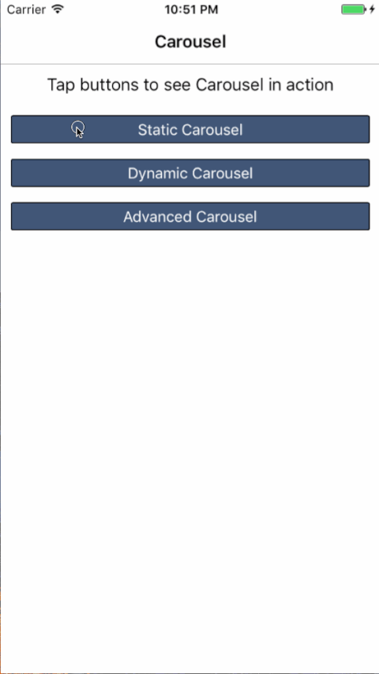

# NativeScript Carousel
A simple, iOS, carousel component for NativeScript based on the DKCarouselView pod: https://github.com/zhangao0086/DKCarouselView

## Installation
Run  ```npm i nativescript-carousel``` in the ROOT directory of your project.

## Limitations
- Currently no Android support, only iOS. If anyone knows of a similar Android component that we can use, please let me know.
- Interactive components innside the CarouselItem are not possible (buttons, sliders, dropdown, ect) will have no effect.

## Usage
*Make sure you include `xmlns:ns="nativescript-carousel"` on the Page element!*

#### * Manually create each slide by using `CarouselItem`
```xml
<ns:Carousel height="250" pageChanged="myChangeEvent" pageTapped="mySelectedEvent">
    <ns:CarouselItem id="slide1"  verticalAlignment="center" backgroundColor="#b3cde0" height="250">
        <Label text="Slide 1" verticalAlignment="center" horizontalAlignment="center"/>
    </ns:CarouselItem>
    <ns:CarouselItem id="slide2" verticalAlignment="center" backgroundColor="#6497b1" height="250">
        <Label text="Slide 2" verticalAlignment="center" horizontalAlignment="center"/>
    </ns:CarouselItem>
    <ns:CarouselItem id="slide3" verticalAlignment="center" backgroundColor="#005b96" height="250">
        <Label text="Slide 3" verticalAlignment="center" horizontalAlignment="center"/>
    </ns:CarouselItem>
</ns:Carousel>
```

#### * Or use a template by wrapping a single `CarouselItem` with `Carousel.itemTemplate` and assigning the `items` property with an array of data.
```xml
<ns:Carousel items="{{ myDataArray }}" height="250" pageChanged="myChangeEvent" pageTapped="mySelectedEvent">
    <ns:Carousel.itemTemplate>
        <ns:CarouselItem  verticalAlignment="center" backgroundColor="{{ color }}" height="250">
            <Label text="{{ title }}"  horizontalAlignment="center"/>
            <Image src="{{ image }}" height="100" />
        </ns:CarouselItem>
    </ns:Carousel.itemTemplate>
</ns:Carousel>
```

### Events
```js
exports.myChangeEvent = function(args){
    var changeEventText = "Page changed to index: " + args.index;
    console.log(changeEventText);
}
exports.mySelectedEvent = function(args){
    var tappedViewText = "Tapped index: " + args.index;
     console.log(tappedViewText);
}
```

## Attributes
* **items** *optional* (must be used with `itemTemplate`)

Assign a data-array to generate the slides and apply the bindingContext. If items is populated then you must use the template-option.

* **itemTemplate** *optional* (must be used with `items`)

Defines the view template for each slide-view to be generated. 

* **autoPagingInterval** *optional*

Defines the interval in seconds to wait before the next slide is shown. Default is 0 (off).

* **showIndicator** *optional*

Shows or hides the page-indicator bullets

* **indicatorColor** *optional*

Sets the active indicator color. Default is semi-transparent white. Use hex or color-name. 

* **indicatorOffset** *optional*

By default the indicator is centered at the bottom. You can use points (x,y) to move the indicator. E.g. `indicatorOffset="100,100"`

* **ios**

Returns the `DKCarouselView` object.

## Screenshots


## Authors
Nedim Erkocevic

## Help
I will accept pull requests that improve this and assign credit. All code needs to be Apache-2.0 licensed.